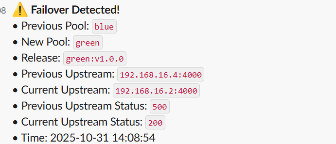
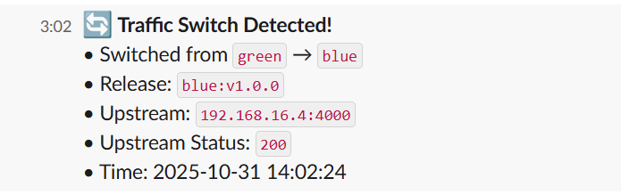
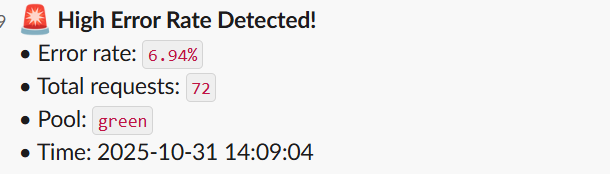
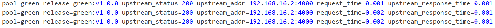

# 🧠 Nginx Failover & Error Monitoring System

This lightweight monitoring service adds **operational visibility** and **actionable alerts** to your Nginx blue/green deployment.

It watches the Nginx access logs in real-time, detects failovers, tracks error rates, and posts alerts and summary reports to a Slack channel.

---

## 🚀 Features

✅ **Failover Detection**
- Detects when Nginx traffic switches between `blue` and `green` pools.
- Sends formatted Slack alerts when a traffic switch occurs.

✅ **Error Rate Monitoring**
- Tracks recent HTTP requests and computes rolling error rates.
- Sends a Slack alert when the error rate exceeds the configured threshold.

✅ **Environment-Driven Configuration**
- Fully configurable through `.env` variables — easy to tune thresholds or intervals.

---

## 🧩 Architecture Overview

```plaintext
+-----------------+
|  Client Request |
+-----------------+
          |
          v
+-----------------------+
|        NGINX          |
| - Blue/Green Upstream |
| - Access Log Output   |
+-----------------------+
          |
          v
+-----------------------+
|  Python Monitor Side  |
| - Watches Nginx logs  |
| - Parses metadata     |
| - Sends Slack alerts  |
+-----------------------+
````

The set up is quite simple and flexible. The docker-compose.yml is used to configure the nginx server set up and also a side container with a python watcher.py script that scans through the nginx logs to detect any anomaly which it sends to slack through slack webhook url

### Step 1

When the service starts with the command `docker compose up --build` all the services nginx, app_blue, app_green, monitor starts running. The monitor and nginx shares the same volume for log file so that nginx can write to it and monitor. Once the service is running then run curl `http://<ip-address>:8080/version` it will give a 200 response with a json response body
````{
    "status": "OK",
    "message": "Application version in header"
} 
````

When you check the headers you will see
````
X-App-Pool: blue
X-Release-Id: blue:v1.0.0
````
This show that the upstream server blue is up and running

### Step 2

Trigger the chaos so that the main upstream server will not be available with the command `curl -X POST 'http//<ip-address>:8081/chaos/start?mode=timeout or curl -X POST 'http//<ip-address>:8081/chaos/start?mode=error`. Once this endpoint is called it makes the upstream blue server not to be available

### Step 3

Then call the same endpoint in step 1. It will still return the same status and body but with different headers
````
X-App-Pool: green
X-Release-Id: green:v1.0.0
````

What happened is that automatic failover has happened and the green server is now serving the client

### Step 4

Stop the chaos by calling `curl -X POST 'http//<ip-address>:8081/chaos/stop` this stops the chaos and brings the blue server back online so that the next call to the version endpoint in step 1 it will return the same headers as in step one

## Alerts

When there is a failover this means that the blue server returns a 5xx error message that makes the nginx to switch to the backup green server and the monitor will send an alert to the slack chanel as show below

once the monitor detects an error code from the main server it sends the failover alert. Also the chaos stops and the blue server comes online the monitor service will also notice a switch from green to blue server through the server pool change. It will also send an alert shown below


Then the monitor service also monitors for high error rate. This is a situation where the blue server is failing very rapidy over a particular time interval. It will also send a high error rate alert as shown below. This can be simulated with a powershell script for windows users [Error Script](simulate.ps1) or bash script for linus users [Bash Scrip](simulate.sh)


A screen shot from the nginx logs is also shown below
